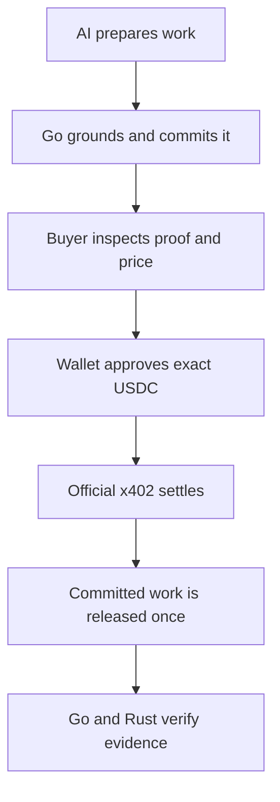

# PayPerPrompt x402

**Proof-before-payment AI commerce on Base Sepolia.**

PayPerPrompt prepares and validates useful AI work before a wallet opens. The
buyer inspects the task, route, exact USDC price, quality evidence, expiry, and
SHA-256 commitment. After explicit browser-wallet approval and official x402
settlement, the API releases only that committed result and returns a
transaction receipt.

The project is a working hackathon MVP for AI builders, agent platforms, and
small SaaS teams. It supports paid writing, analysis, code work, prompt
security, and bounded Solidity assistance at exact prices of 0.01, 0.02, or
0.04 USDC per completed request.

> Base Sepolia only. This code is not formally audited or production deployed.
> Never use a mainnet wallet or place a private key or seed phrase in the
> repository.

## Why this is different

A normal paywall proves that money moved. PayPerPrompt connects payment to a
specific prepared deliverable:



Preparation, policy, and validation failures stop before the wallet can sign.
An ambiguous settlement enters reconciliation instead of being blindly paid
again.

## Verified public proof

| Field | Value |
|---|---|
| Network | Base Sepolia (`eip155:84532`) |
| Asset | Official Base Sepolia USDC |
| Amount | 0.02 USDC (`20000` atomic units) |
| Provider | Rapid Policy |
| Route | `guardrail-fast` |
| Transaction | [`0xfcf4…c3e5`](https://sepolia.basescan.org/tx/0xfcf4b744479fed99b483d9bd665b67af014c6cb56e55e1492e1bee121dc4c3e5) |
| Work commitment | `fb1667e4c2b5c0de9fc8e2ae2d6f1c33f1496c0569d2475180147c069ab98338` |

See [the complete proof record](docs/official-x402-proof.md).

## Components

| Component | Responsibility |
|---|---|
| Ollama | identifies the task, selects a route, and prepares the work |
| Go control plane | grounds output, commits work, enforces budgets, records audit metadata, and reconciles outcomes |
| Official x402 Go lane | creates HTTP 402 requirements and verifies/settles Base Sepolia USDC |
| Rust verifier | independently checks canonical proof fields and rejects altered evidence |
| Browser workspace | trusted-wallet discovery, exact payment approval, work release, audit, and proof display |
| Go SDK and CLI | service discovery, planning, inspection, debugging, verification, and reconciliation |

## Requirements

- Linux or WSL
- Go 1.24 or newer
- Rust toolchain with Cargo
- Python 3, `curl`, `unzip`, `rsync`, and `zip`
- Ollama with `llama3.1:8b`
- MetaMask, Coinbase Wallet, or Rabby
- a disposable Base Sepolia payer with test ETH and USDC
- a different public Base Sepolia merchant address
- `cloudflared` for the optional public HTTPS demo

## Quick start

### 1. Prepare Ollama and Cloudflare

```bash
ollama pull llama3.1:8b
ollama serve
```

In another terminal:

```bash
curl -L \
  https://github.com/cloudflare/cloudflared/releases/latest/download/cloudflared-linux-amd64 \
  -o /tmp/cloudflared
chmod 700 /tmp/cloudflared
```

### 2. Configure public testnet addresses

```bash
cd payperprompt-x402
./scripts/configure-public-demo.sh
```

Enter only:

- the disposable payer's **public address**;
- a distinct merchant's **public address**;
- the per-call and daily USDC limits.

The script creates an ignored, owner-readable `.env.local`. It does not request
or store a private key, seed phrase, wallet password, or recovery phrase.
Signing remains inside the recognized browser wallet.

See [Browser Wallet Configuration](docs/WALLET-CONFIGURATION.md).

### 3. Run the acceptance gate

```bash
./scripts/test-submission-proof-kit.sh
```

Stop if any Go, Rust, SDK, wallet-safety, semantic-grounding, or packaging
check fails.

### 4. Start the complete stack

```bash
./scripts/start-judge-stack.sh
```

The launcher prepares official x402 dependencies, starts the Rust verifier,
official x402 lane, and Go control plane, installs the configured payer policy,
then creates a temporary HTTPS tunnel.

- local workspace: `http://127.0.0.1:8084`
- official protected service: `http://127.0.0.1:8082`
- public workspace: the printed `https://….trycloudflare.com` URL

Keep the launcher terminal open. Press `Ctrl+C` once to stop the stack.

### 5. Run the browser flow

1. Connect the configured disposable wallet.
2. Confirm Base Sepolia.
3. Choose a work type or enter a custom request.
4. Select **Ask AI to Plan Payment**.
5. Inspect the prepared-work summary, validation, commitment, route, expiry,
   and exact price.
6. Approve only if the proof is credible.
7. Confirm the exact test USDC authorization in the wallet.
8. Inspect the released work, receipt, audit event, and BaseScan transaction.
9. Run **Live x402 Evidence**; it re-verifies evidence without another payment.

The full judge path is in [Start Here](START-HERE-OFFICIAL.md).

## Configuration

`.env.example` documents every supported public-demo setting. The guided setup
normally creates:

```dotenv
PAYER_ADDRESS=0xPUBLIC_DISPOSABLE_BASE_SEPOLIA_PAYER
MERCHANT_ADDRESS=0xDIFFERENT_PUBLIC_BASE_SEPOLIA_MERCHANT
MAX_PER_CALL_USD=0.05
DAILY_LIMIT_USD=2.00
X402_NETWORK=eip155:84532
X402_ASSET=0x036CbD53842c5426634e7929541eC2318f3dCF7e
```

`.env.local` is ignored by Git and excluded from release archives. Historical
addresses in proof documentation are public transaction evidence, not runtime
wallet configuration.

## Developer tools

The dashboard and CLI expose each payment stage:

```text
payperprompt catalog
payperprompt analyze
payperprompt debug-challenge
payperprompt agent-preflight
payperprompt agent-pay
payperprompt verify-proof
payperprompt facilitators
payperprompt reconcile
```

The dependency-free SDK can be tested and inspected with:

```bash
cd sdk/go
go test ./...
go run ./cmd/inspect -history
```

The SDK deliberately does not accept private keys. Browser signing and the
official x402 client remain separate from service discovery and proof reads.

## Repository map

| Path | Purpose |
|---|---|
| `go-core/` | durable control plane and dashboard API |
| `real-x402-go/` | official x402 server/client and grounded AI worker |
| `receipt-verifier-rust/` | independent receipt/proof verifier |
| `sdk/go/` | reusable client SDK |
| `web/` | paid AI workspace |
| `scripts/` | setup, tests, launcher, recovery, and packaging |
| `docs/` | architecture, security, proof, hosting, and submission guides |
| `examples/large-contract-prompts/` | larger Solidity validation fixtures |

## Public hosting and judge availability

The Quick Tunnel exists only while the host computer is online. It should not
be the submission's only permanent link.

Publish the static proof page from `docs/` with GitHub Pages and submit:

- the public repository;
- the static proof page;
- the YouTube demo;
- the BaseScan transaction;
- the live demo URL only when stable or clearly labelled as temporary.

See [Hosting and Judge Availability](docs/HOSTING-AND-JUDGE-AVAILABILITY.md).

## Build a clean release

```bash
./scripts/build-submission-package.sh
sha256sum -c dist/payperprompt-x402-v0.41.0.1-public-repository.zip.sha256
```

The archive excludes `.env.local`, runtime ledgers, generated proof files,
downloaded dependencies, compiled binaries, caches, and secret-like files.

## Safety and honest scope

- No private key or seed-phrase input exists.
- The live flow accepts one configured disposable testnet payer.
- The simulator uses fake funds and is labelled separately.
- Smart Contract Studio can generate, explain, test, repair, and defensively
  review Solidity; it cannot deploy, sign transactions, or move assets.
- Base Sepolia proves the architecture; it is not a mainnet launch.
- Mainnet operation requires external review, authenticated multi-tenancy,
  managed secrets, stable storage, monitoring, rate limiting, and incident
  response.

Read [SECURITY.md](SECURITY.md) before exposing the project publicly and
[CONTRIBUTING.md](CONTRIBUTING.md) before changing payment boundaries.

## Hackathon coverage

- **Track 1:** useful AI work delivered after x402 settlement
- **Track 2:** route selection, spend policy, prepared-work commitment,
  receipts, audit, replay control, and reconciliation
- **Track 3:** Go SDK, CLI, simulator, challenge debugger, and proof verifier
- **Track 4:** browser-wallet Base Sepolia USDC settlement
- **Track 5:** bounded AI, code, security, document, and business work

The requirement-to-evidence mapping is in
[docs/hackathon-coverage.md](docs/hackathon-coverage.md).

## License

[MIT](LICENSE)
